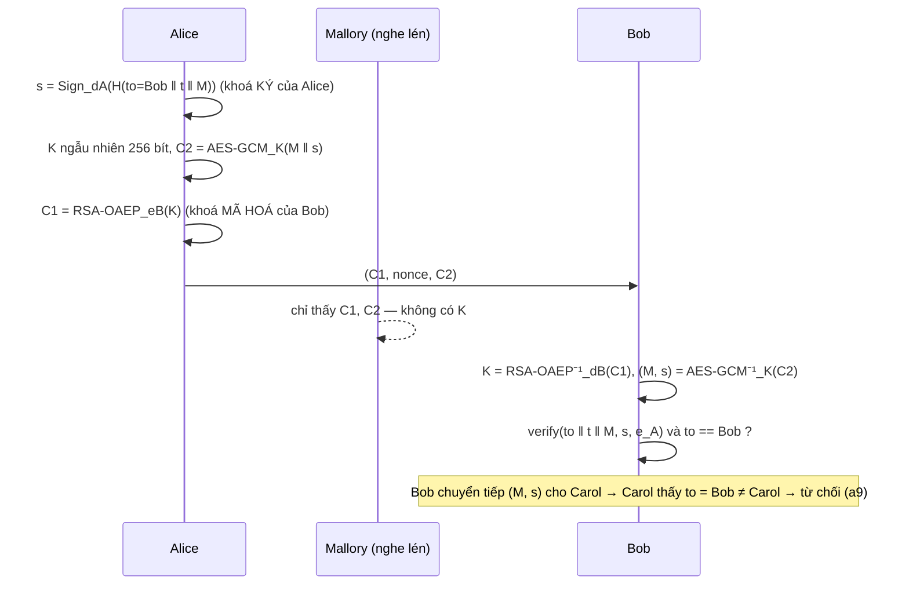

# Phong bì số: ký rồi mã hoá (`scenarios/s6_sign_then_encrypt.py`)

```mermaid
sequenceDiagram
    participant A as Alice
    participant M as Mallory (nghe lén)
    participant B as Bob
    A->>A: s = Sign_dA(H(to=Bob ‖ t ‖ M))  (khoá KÝ của Alice)
    A->>A: K ngẫu nhiên 256 bít, C2 = AES-GCM_K(M ‖ s)
    A->>A: C1 = RSA-OAEP_eB(K)  (khoá MÃ HOÁ của Bob)
    A->>B: (C1, nonce, C2)
    M-->>M: chỉ thấy C1, C2 — không có K
    B->>B: K = RSA-OAEP⁻¹_dB(C1), (M, s) = AES-GCM⁻¹_K(C2)
    B->>B: verify(to ‖ t ‖ M, s, e_A) và to == Bob ?
    Note over B: Bob chuyển tiếp (M, s) cho Carol → Carol thấy to = Bob ≠ Carol → từ chối (a9)
```
