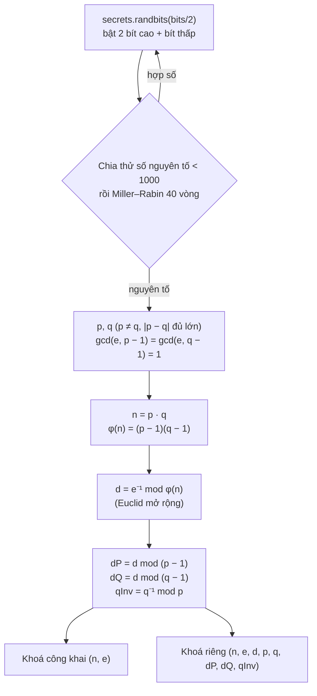

# Sinh khoá RSA (`core/rsa_keygen.py`)

```mermaid
flowchart TD
    A["secrets.randbits(bits/2)<br/>bật 2 bít cao + bít thấp"] --> B{"Chia thử số nguyên tố &lt; 1000<br/>rồi Miller–Rabin 40 vòng"}
    B -- hợp số --> A
    B -- nguyên tố --> C["p, q (p ≠ q, |p − q| đủ lớn)<br/>gcd(e, p − 1) = gcd(e, q − 1) = 1"]
    C --> D["n = p · q<br/>φ(n) = (p − 1)(q − 1)"]
    D --> E["d = e⁻¹ mod φ(n)<br/>(Euclid mở rộng)"]
    E --> F["dP = d mod (p − 1)<br/>dQ = d mod (q − 1)<br/>qInv = q⁻¹ mod p"]
    F --> G["Khoá công khai (n, e)"]
    F --> H["Khoá riêng (n, e, d, p, q, dP, dQ, qInv)"]
```
