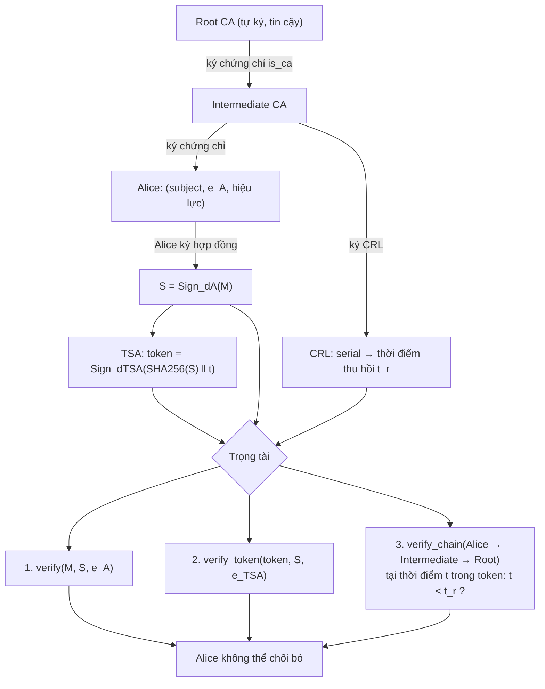

# PKI: chứng chỉ, thu hồi, dấu thời gian (`pki/`)

```mermaid
flowchart TD
    R["Root CA (tự ký, tin cậy)"] -- "ký chứng chỉ is_ca" --> I["Intermediate CA"]
    I -- "ký chứng chỉ" --> A["Alice: (subject, e_A, hiệu lực)"]
    I -- "ký CRL" --> CRL["CRL: serial → thời điểm thu hồi t_r"]
    A -- "Alice ký hợp đồng" --> S["S = Sign_dA(M)"]
    S --> T["TSA: token = Sign_dTSA(SHA256(S) ‖ t)"]
    T --> J{"Trọng tài"}
    S --> J
    CRL --> J
    J --> J1["1. verify(M, S, e_A)"]
    J --> J2["2. verify_token(token, S, e_TSA)"]
    J --> J3["3. verify_chain(Alice → Intermediate → Root)<br/>tại thời điểm t trong token: t &lt; t_r ?"]
    J1 & J2 & J3 --> K["Alice không thể chối bỏ"]
```
