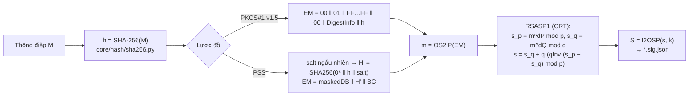

# Ký (Alice, `core/signature.py`)

```mermaid
flowchart LR
    M["Thông điệp M"] --> H["h = SHA-256(M)<br/>core/hash/sha256.py"]
    H --> E{"Lược đồ"}
    E -- PKCS#1 v1.5 --> P1["EM = 00 ‖ 01 ‖ FF…FF ‖ 00 ‖ DigestInfo ‖ h"]
    E -- PSS --> P2["salt ngẫu nhiên → H' = SHA256(0⁸ ‖ h ‖ salt)<br/>EM = maskedDB ‖ H' ‖ BC"]
    P1 --> I["m = OS2IP(EM)"]
    P2 --> I
    I --> S["RSASP1 (CRT):<br/>s_p = m^dP mod p, s_q = m^dQ mod q<br/>s = s_q + q·(qInv·(s_p − s_q) mod p)"]
    S --> O["S = I2OSP(s, k)<br/>→ *.sig.json"]
```
