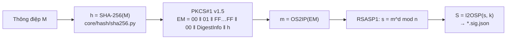

# Ký (trang, `core/signature.py`)

```mermaid
flowchart LR
    M["Thông điệp M"] --> H["h = SHA-256(M)<br/>core/hash/sha256.py"]
    H --> P1["PKCS#1 v1.5<br/>EM = 00 ‖ 01 ‖ FF…FF ‖ 00 ‖ DigestInfo ‖ h"]
    P1 --> I["m = OS2IP(EM)"]
    I --> S["RSASP1: s = m^d mod n"]
    S --> O["S = I2OSP(s, k)<br/>→ *.sig.json"]
```
