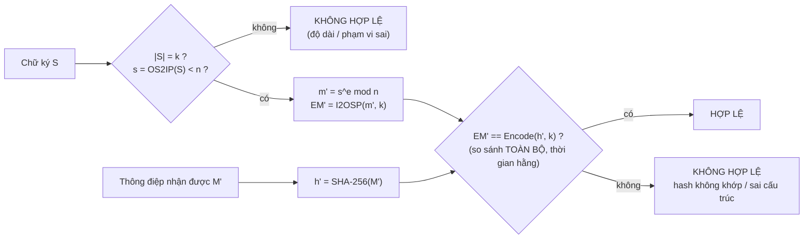

# Kiểm tra chữ ký (thuy, `core/signature.py`)

```mermaid
flowchart LR
    S["Chữ ký S"] --> L{"|S| = k ?<br/>s = OS2IP(S) &lt; n ?"}
    L -- không --> X["KHÔNG HỢP LỆ<br/>(độ dài / phạm vi sai)"]
    L -- có --> V["m' = s^e mod n<br/>EM' = I2OSP(m', k)"]
    M["Thông điệp nhận được M'"] --> H["h' = SHA-256(M')"]
    H --> C{"EM' == Encode(h', k) ?<br/>(so sánh TOÀN BỘ, thời gian hằng)"}
    V --> C
    C -- có --> OK["HỢP LỆ"]
    C -- không --> NO["KHÔNG HỢP LỆ<br/>hash không khớp / sai cấu trúc"]
```
